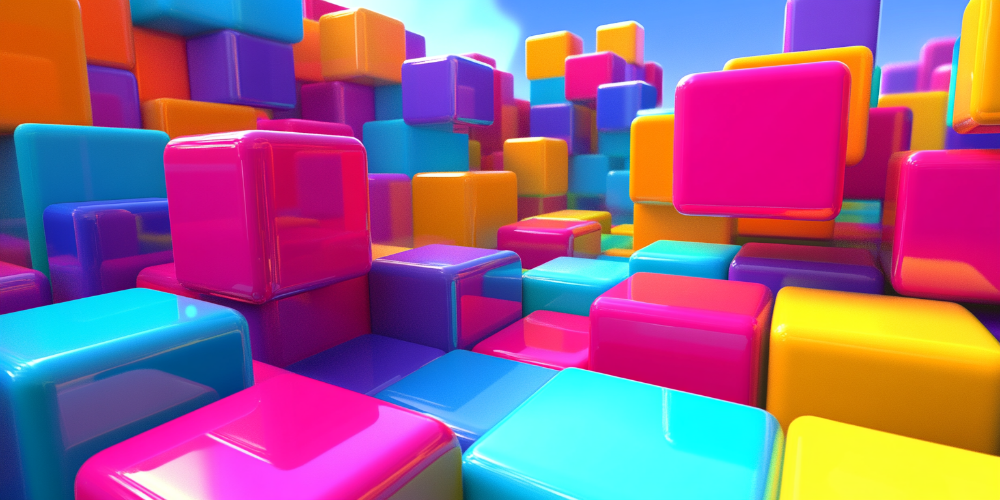
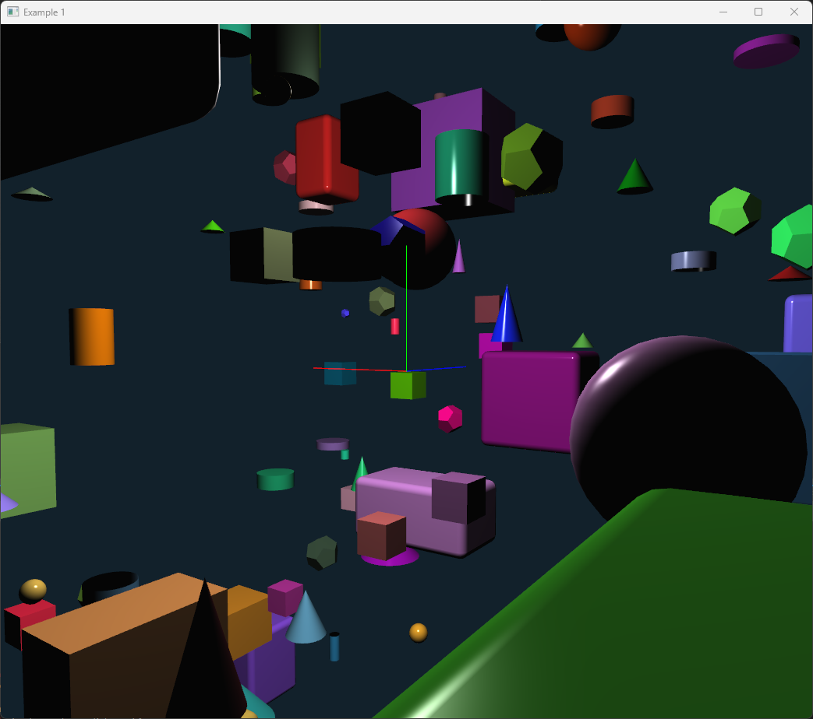

# The fun of coding 3D graphics in C++ and OpenGL



There exist several 3D graphics libraries for C++ using OpenGL such as [Raylib](https://www.raylib.com/), [OpenSceneGraph](https://www.openscenegraph.org/), [VTK](https://vtk.org/), [Magnum](https://magnum.graphics/), [Cinder](https://libcinder.org/), [OpenFrameworks](https://openframeworks.cc/) and many more.

There also game engines using C++ such as [Unreal Engine](https://www.unrealengine.com/), [Godot](https://godotengine.org/), [CryEngine](https://www.cryengine.com/), [Lumberyard](https://aws.amazon.com/lumberyard/) and more.

However, my needs for 3d programming have not been for games but for interactive 3d applications mainly in the field of engineering. I have used OpenGL for many years. For my PhD I developed a 3D Scene Graph library, Ivf++, which was a wrapper around OpenGL. It contained a set of nodes for implementing interactive 3D applications, such as ObjectiveFrame a 3D beam analysis application focusing on real-time interaction. 

During the last decade OpenGL has evolved and the fixed function pipeline has been deprecated. Modern OpenGL is based on shaders and the programmable pipeline. This has made OpenGL more powerful, but with the cost of complexity and ease of use. This article is about my journey implementing a new 3D graphics library for C++ that is easy to use and at the same time flexible. Ultimately I want to get back to ease of use of the fixed function pipeline but with the power of modern OpenGL.

<!-- more -->

In an effort to learn modern OpenGL I started to reimplement the Ivf++ library using modern shader based OpenGL. I didn't want to refactor the original library as it is used in ObjectiveFrame, so I decided to create a new library from scratch, ivf2. At a high level I wanted to remove as many obstacles as possible programming 3D graphics applications in C++. The library should be easy to use and at the same time powerful. Also, it should be fun to create 3D applications in C++. Perhaps I will use it for creative coding at some point in the future.

## Design goals

As the library is a work in progress, the design goals are not yet fully realized and will probarbly change over time. However, the following are some of the goals I have in mind:

- **Easy to use** - consistent syntax and API that is easy to understand)
- **Modern OpenGL** - support modern OpenGL features
- **Scene Graph** - main focus of rendering is the scene graph
- **Rich set of primitives** - support for common 3D primitives
- **Interactive** - support for easy interaction with the 3D scene
- **Built-in window support (GLFW)** - it should be easy to create a window in the library
- **Build-in GUI support (ImGui)** - immediate mode GUI for easy interaction with the application
- **Fully object-oriented** - use of classes and objects for easy programming
- **Robust** - shared and unique pointer support
- **Built-in stock shaders** - no need to implement shaders for simple applications
- **Post processing effects** - built-in support for post processing effects

## The journey starts

The first steps in implementing the library was to create a flexible infrastructure compiling and linking shaders and keeping track of these. Shaders support in ivf2 is implemented in number of classes:

- **Shader** - a class for loading and compiling a shader. 
- **Program** - a class for linking shaders into a program. 
- **ShaderManager** - a class for managing shaders and programs.

The **Shader** class can load shaders from file and from strings. The built-in stock shaders are loaded from strings that are included from <ivf/stock_shaders.h>. The **Program** class links shaders into a program. The class also provides an interface to the shader uniforms. The following example shows how to create a simple shader program:

```cpp
#include <ivf/vertex_shader.h>
#include <ivf/fragment_shader.h>
#include <ivf/program.h>
#include <ivf/stock_shaders.h>

int main() 
{
    // Initialization

    auto vertexShader = VertexShader::create(ivf::basic_vert_shader_source);
    auto fragmentShader = FragmentShader::create(ivf::basic_frag_shader_source);

    auto program = Program::create();

    program.addShader(vertexShader);
    program.addShader(fragmentShader);
    
    if (!program.link())
    {
        std::cout << "Failed to compile and link program." << std::endl;
        return -1;
    }

        // Main game loop

    while (!WindowShouldClose()) 
    {
        // Draw

        program->use();
        program->uniformFloat("time", GetTime());
        // Draw something
    }

    // De-Initialization

    return 0;
}
```

To make it even easier to load and manage shaders a special singleton class **ShaderManager** is used. The **ShaderManager** class is a singleton class that manages shaders and programs. The shader manager implements methods for directly loading and compiling shaders to named programs. The following example shows how to create a simple shader program using the **ShaderManager**:

```cpp
#include <ivf/shader_manager.h>
#include <ivf/stock_shaders.h>

int main() 
{
    // Initialization

    auto shaderManager = ShaderManager::getInstance();
    auto program = shaderManager->loadProgram("basic", ivf::basic_vert_shader_source, ivf::basic_frag_shader_source);
   
    if (shaderManager->compileLinkErrors())
    {
        std::cout << "Failed to compile and link program." << std::endl;
        return -1;
    }

    // Main game loop

    while (!WindowShouldClose()) 
    {
        // Draw

        program->use();
        program->uniformFloat("time", GetTime());
        // Draw something
    }

    // De-Initialization

    return 0;
}
```

Compiled programs can be convieniently accessed by name using the **ShaderManager**. 

```cpp
// Get named program

auto program = shaderManager->program("basic");

// The the current program

shaderManager->setCurrentProgram("basic");

auto program = shaderManager->currentProgram();
```

## Not calling new and delete...

One major goal of the library was to be able to use shared and unique pointers for managing objects. This means that you don't have to call new and delete for creating objects. The library is fully object-oriented and uses shared and unique pointers for managing objects. 

To support shared pointers and also supporting new users I decided that all classes implemented by the library should have a static create method, which can be called to create an object. By combining this with the auto keyword in C++11, the code becomes very clean and easy to read. The following example shows how to create a shared pointer to a ivf::Cylinder object:

```cpp
using namespace ivf;

auto cylinder = Cylinder::create(1.0, 1.0, 32);
```

The **create** method is a static method that returns a shared pointer to the object. The object is automatically deleted when the last shared pointer goes out of scope.

The syntax of using a **create()** method is heavily inspired by Object Pascal and Delphi. I have used Delphi for many years and I like the syntax of creating objects in Delphi.

To make it easier for new users of the library, all classes also defined a typedef for a shared pointer to the object. This means that you can use the typedef to create a shared pointer to the object. The following example shows how to create a shared pointer to a ivf::Cylinder object using the typedef:

```cpp

using namespace ivf;

CylinderPtr cylinder = Cylinder::create(1.0, 1.0, 32);

// Equivalent to
// std::shared_ptr<Cylinder> cylinder = std::make_shared<Cylinder>(1.0, 1.0, 32);
```

As the library heavily relies on Polymorphism, using shared pointers is a natural choice. The library is designed to be used with shared pointers and the library itself uses shared pointers for managing objects.

## The Scene Graph

The scene graph in ivf2 is based on 2 main classes **Node** and **CompositeNode**. The **Node** class is the base class for all nodes in the scene graph. The **CompositeNode** class is a node that can contain other nodes. The scene graph is a tree structure where each node can have a parent and children. The scene graph is traversed in a depth-first manner. The following example shows how to create a simple scene graph:

```cpp
#include <ivf/gl.h>
#include <ivf/nodes.h>

int main() 
{
    // ...

    auto scene = CompositeNode::create();
    auto cube = Cube::create();
    auto sphere = Sphere::create();

    scene->add(cube);

    // ...

    scene->draw();

    // ...

    return 0;
}
```

Most primitive classes derive from the **TransformNode** class which provides basic transformation functionality. The **TransformNode** class is a node that can be transformed using translation, rotation and scaling. The following example shows how to create a simple scene graph with a transformed cube:

```cpp

auto scene = CompositeNode::create();
auto cube = Cube::create();
auto sphere = Sphere::create();

cube->setPos(glm::vec3(0.0, 1.0, 0.0));
sphere->setPos(glm::vec3(1.0, 0.0, 0.0));
```

## MeshNode and primitives 

I realised the time for immediate mode rendering is over. The library is based on modern OpenGL and uses Vertex Buffer Objects (VBO) and Vertex Array Objects (VAO) for rendering. The **MeshNode** class implements the functionality for rendering creating meshes using VBOs and VAOs using a simple interface similar to the fixed function pipeline. To implement a mesh, a derived class overrides the **doSetup** method of the **MeshNode**-class. The following example shows how the **Cube** class implements its mesh:


```cpp 
void Cube::doSetup()
{
    //   y  o--------o
    //   ^ /|       /| 
    //   |/ |     2/ |
    //  3o--------o  |
    //   |  o-----|--o 
    //   | /      | / 
    //   |/       |/
    //   o--------o --> x
    //   0        1

    double n = m_size/2.0;

    mesh()->begin(GL_TRIANGLES);
    mesh()->vertex3d(-n, -n, n);
    mesh()->color3f(1.0f, 0.0f, 0.0f);
    mesh()->vertex3d(n, -n, n);
    mesh()->color3f(1.0f, 0.0f, 1.0f);
    mesh()->vertex3d(n, n, n);
    mesh()->color3f(1.0f, 1.0f, 0.0f);
    mesh()->vertex3d(-n, n, n);
    mesh()->color3f(1.0f, 1.0f, 1.0f);

    mesh()->index3i(0, 1, 2); // front
    mesh()->index3i(0, 2, 3);

    mesh()->vertex3d(-n, -n, -n);
    mesh()->color3f(0.0f, 0.0f, 1.0f);
    mesh()->vertex3d(n, -n, -n);
    mesh()->color3f(0.0f, 1.0f, 0.0f);
    mesh()->vertex3d(n, n, -n);
    mesh()->color3f(0.0f, 1.0f, 1.0f);
    mesh()->vertex3d(-n, n, -n);
    mesh()->color3f(1.0f, 0.0f, 0.0f);

    mesh()->index3i(4, 6, 5); // back
    mesh()->index3i(4, 7, 6);

    // ...

    mesh()->end();
}
```

I also realised that implementing all primitives in the library would be a huge task. To solve this I search the internet and github for a solution to this problem. What I found was a geometry generator called [Generator](https://github.com/ilmola/generator). It is a header only library that can generate most basic primitives shapes that can be used in 3D graphics. Most of the primitives in ivf2 are implemented using the Generator library. The following example shows how to create a sphere using the Generator library:

```cpp
// ...

void Sphere::doSetup()
{
    SphereMesh sphere(m_radius, m_slices, m_segments, m_sliceStart, m_sliceSweep, m_segmentStart, m_segmentSweep);

    AnyGenerator<MeshVertex> vertices = sphere.vertices();
    AnyGenerator<Triangle> triangles = sphere.triangles();

    this->createFromGenerator(vertices, triangles);
}

// ...
```

To support generating geometry using this library the **MeshNode** class implements a special method **createFromGenerator** that can create a mesh from a generator. The **createFromGenerator** method takes two generators, one for vertices and one for triangles. 

## Lights, materials and textures

To recreate an environment similar to the fixed function pipeline, ivf2 comes with built-in support for lights, materials and textures. The **Light** class implements a light source that can be used in the scene. The **Material** class implements a material that can be used to set the material properties of an object. The **Texture** class implements a texture that can be used to texture an object. The following example shows how to create a light, material and texture:

```cpp

auto shaderMgr = ShaderManager::create();

// Load our basic shader

shaderMgr->loadBasicShader();

// Lights are managed by the LightManager

auto lightMgr = LightManager::create();

// Add a point light

auto pointLight1 = lightMgr->addPointLight();
pointLight1->setEnabled(true);
pointLight1->setDiffuseColor(glm::vec3(1.0, 1.0, 1.0));
pointLight1->setSpecularColor(glm::vec3(1.0, 1.0, 1.0));
pointLight1->setAttenuation(1.0, 0.0, 0.0);
pointLight1->setPosition(glm::vec3(5.0, 5.0, 5.0));

// Update the shader

lightMgr->apply();

// Create a material

auto material = Material::create();
material->setDiffuseColor(glm::vec4(random(0.0, 1.0), random(0.0, 1.0), random(0.0, 1.0), 1.0));
material->setAmbientColor(glm::vec4(0.1, 0.1, 0.1, 1.0));

// Create a sphere with an attached material

auto sphere = Sphere::create();
sphere->setMaterial(material);

// ...
```

Textures can also be attached to nodes in the scene graph. The **Texture** class implements a texture that can be used to texture an object. The following example shows how to create a texture and attach it to a node:

```cpp
auto textureCat = Texture::create();
textureCat->load("assets/pop_cat.png");

auto textureBrick = Texture::create();
textureBrick->load("assets/brick.png");

auto sphere = Sphere::create();
sphere->setTexture(textureCat);
sphere->setMaterial(sphereMaterial);
sphere->setPos(glm::vec3(0.0, 3.0, 0.0));

auto box = Box::create();
box->setTexture(textureBrick);
box->setMaterial(sphereMaterial);
box->setPos(glm::vec3(3.0, 0.0, 0.0));
```

## Windows and GUI

To make it easy to create a window and GUI in the library, ivf2 comes with built-in support for GLFW and ImGui in the **ivfui**-library. Window support in ivf2 is implemented using the GLFW library encapsulated in **GLFWApplication**, **GLFWWindow** and **GLFWSceneWindow** classes. The **Application** class is a singleton class that manages GLFW windows and the rendering contexts. The following examples illustrates a versy simple ivf2 GLFW application:

```cpp
#include <iostream>
#include <memory>
#include <vector>

#include <ivfui/glfw_application.h>
#include <ivfui/glfw_window.h>

#include <ivf/gl.h>
#include <ivf/nodes.h>
#include <ivfui/ui.h>

using namespace ivf;
using namespace ivfui;
using namespace std;

class ExampleWindow : public GLFWWindow {
private:
    CompositeNodePtr m_scene;
    CameraManipulatorPtr m_camManip;

public:
    ExampleWindow(int width, int height, std::string title) : GLFWWindow(width, height, title)
    {}

    static std::shared_ptr<ExampleWindow> create(int width, int height, std::string title)
    {
        return std::make_shared<ExampleWindow>(width, height, title);
    }

    int onSetup()
    {
        // Setup the scene

        auto shaderMgr = ShaderManager::create();
        shaderMgr->loadBasicShader();

        auto lightMgr = LightManager::create();

        auto pointLight1 = lightMgr->addPointLight();
        pointLight1->setEnabled(true);
        pointLight1->setDiffuseColor(glm::vec3(1.0, 1.0, 1.0));
        pointLight1->setSpecularColor(glm::vec3(1.0, 1.0, 1.0));
        pointLight1->setAttenuation(1.0, 0.0, 0.0);
        pointLight1->setPosition(glm::vec3(5.0, 5.0, 5.0));
        lightMgr->apply();

        m_scene = CompositeNode::create();

        auto axis = Axis::create();

        m_scene->add(axis);

        // Create more nodes ...

        m_scene->add(node);

        m_camManip = CameraManipulator::create(this->ref());

        return 0;
    }

    void onDraw()
    {
        // This method is called continuously to draw the scene

        glClearColor(0.07f, 0.13f, 0.17f, 1.0f);
        glClear(GL_COLOR_BUFFER_BIT | GL_DEPTH_BUFFER_BIT);

        // Update the camera manipulator
        
        m_camManip->update();

        // Draw the scene

        m_scene->draw();
    }

    void onResize(int width, int height)
    {
        // This method is called when the window is resized

        m_camManip->update();
    }
};

typedef std::shared_ptr<ExampleWindow> ExampleWindowPtr;

int main()
{
    // Create application object

    auto app = GLFWApplication::create();

    // Set context hints

    app->hint(GLFW_CONTEXT_VERSION_MAJOR, 3);
    app->hint(GLFW_CONTEXT_VERSION_MINOR, 3);
    app->hint(GLFW_OPENGL_PROFILE, GLFW_OPENGL_CORE_PROFILE);
    app->hint(GLFW_SAMPLES, 4);

    // Create a window

    auto window = ExampleWindow::create(800, 800, "Example 1");
    window->maximize();

    // Add the window to the application

    app->addWindow(window);

    // Run the application

    return app->loop();
}

```

The final rendered window could look something like this:



## How can you try ivf2?

The library is still in development and not yet ready for release. However, you can try the library by cloning the repository from [https://github.com/jonaslindemann/ivf2](https://github.com/jonaslindemann/ivf2). Build instruction are available in the README.md file in the repository.

## Getting involved

If you are interested in the project and want to get involved, my contact information is here: [Jonas Lindemann](https://www.lu.se/lucat/user/7e4f2075cc49072ab067c1edd5f12fab)