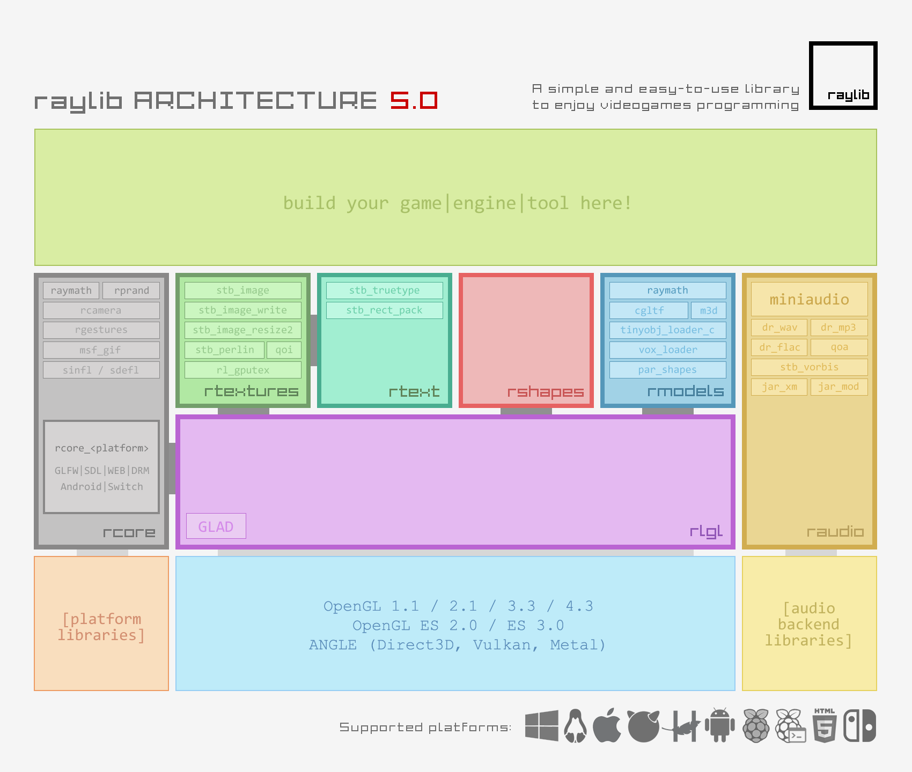

# A new backend for ForcePAD


The current version of ForcePAD is implemented using the FLTK library and OpenGL for graphics. At the time FLTK provided an easy way of implementing an multiplatform application that could run on Windows and Unix/Linux. FLTK provided both an intuitive environment for designing the 2D user interface as well as easy OpenGL context creation. OpenGL context creation on Windows and Unix was implemented very differently on each platform. Having just one way of this enabled ForcePAD to be implemented in a single code base.

<!-- more -->

Using FLTK and OpenGL today has been more problematic. Even though context creation in FLTK is still easy. It is not very flexible preventing new modern OpenGL features from being easily implemented. Also, OpenGL today is a fragmented environment. Apple and macOS are currently not supporting the library and put restrictions on which versions they make available. At this point, I was a bit depressed about the lack of standards in graphics APIs. After I saw a YouTube video on game engines I was impressed with the game library RayLib [(https://www.raylib.com/](https://www.raylib.com/). 



Raylib is a modular game engine that is available on all platforms. When compared to other game engines, Raylib is more of a toolbox where you can use what you need. This is very much the same experience I had with OpenGL a long time ago. The API provides both low-level functions as well as more high-level functions. An example of a very simple RayLib application is shown below:

```cpp
#include "raylib.h"

int main() 
{
    // Initialization

    int screenWidth = 800;
    int screenHeight = 450;

    InitWindow(screenWidth, screenHeight, "Simple RayLib Example");

    SetTargetFPS(60); // Set our game to run at 60 frames-per-second

    // Main game loop

    while (!WindowShouldClose()) 
    {
        // Draw

        BeginDrawing();
        ClearBackground(RAYWHITE);
        DrawText("This is RayLib", 190, 200, 20, LIGHTGRAY);
        EndDrawing();
    }

    // De-Initialization

    CloseWindow(); 

    return 0;
}
```

This application will compile for any supported platform, which currently are:

 * Windows
 * Linux
 * macOS
 * iOS
 * Android
 * Raspberry Pi
 * HTML5

This also means that from the same source code, I can build a native application as well as an application that can be run directly on a web page using web assembly.

In the following blog posts, I will try to describe how I set up the basic project and implement the basic abstractions for the application.

Until the next blog post...

