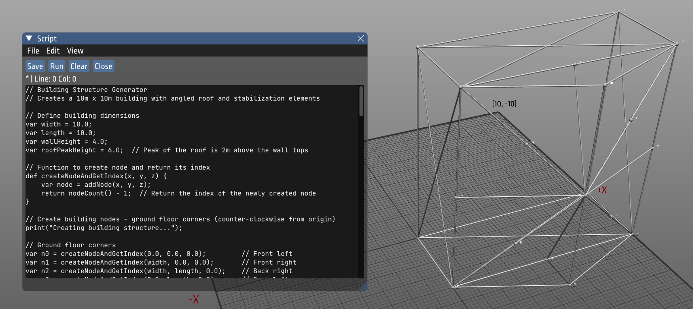
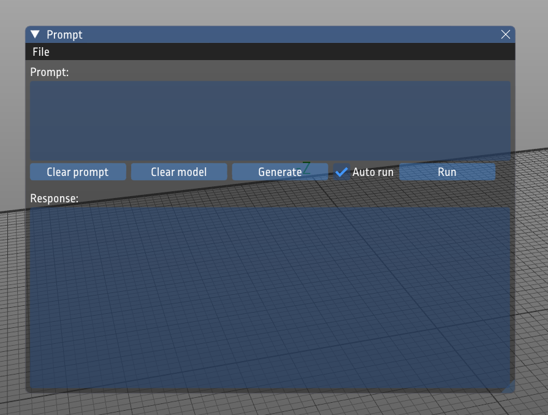
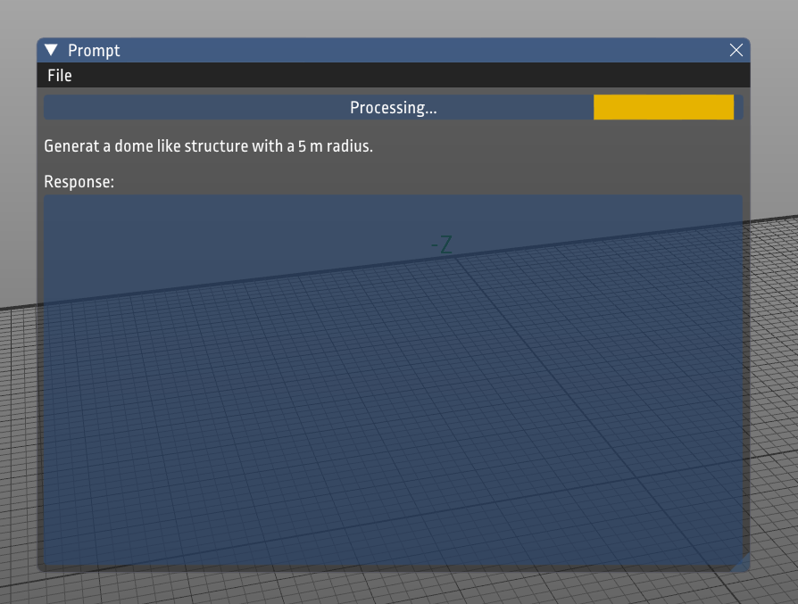
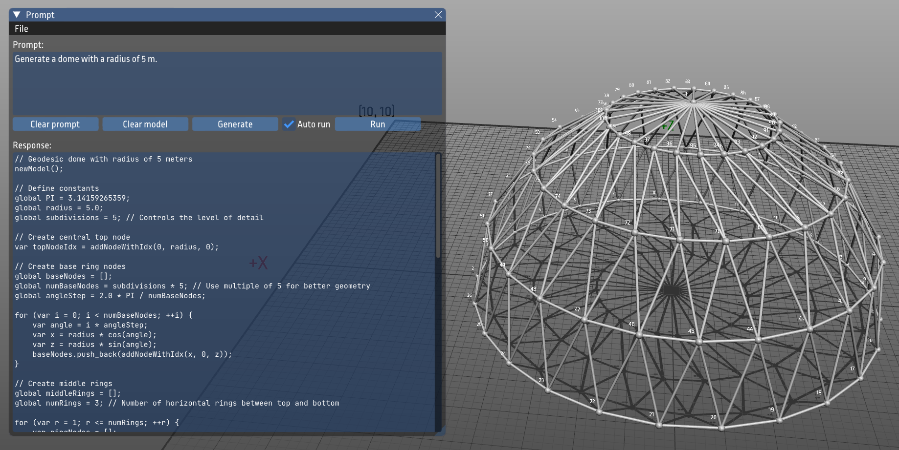

# Experimenting with AI and Mechanics applications


When working on the next version of ObjectiveFrame with improved scripting features, I got the idea to explore how well an AI agent would create a mechanical structure using the built-in scripting language (ChaiScript) in ObjectiveFrame. I had some initial sessions with Claude which confirmed that it was possible to create scripts from textual prompts and run them in the ObjectiveFrame's new scripting environment. This led me to my next idea of adding an interface to an AI agent directly in the ObjectiveFrame application. The AI agent would then be able to create mechanical structures based on the user's prompt. In the following sections, I will describe my process to implement this feature.

<!-- more -->

## First conversations with Claude

To test my idea of generating structures from prompts, I provided Claude with the following prompt:

!!! question 

    I have an 3D beam/bar analysis application that provide the following functions for creating geometry (implemented in chaiscript):

        vfem::Node *addNode(double x, double y, double z);
        vfem::Beam *addBeam(int i0, int i1);
        size_t nodeCount();
        void nodePos(vfem::Node *node, double &x, double &y, double &z);
        void nodePosAt(int i, double &x, double &y, double &z);
        void updateNodePos(vfem::Node *node, double x, double y, double z);
        void updateNodePosAt(int i, double x, double y, double z);
        vfem::Node *nodeAt(int i);
        bool isNodeSelected(vfem::Node *node);
        bool isNodeSelectedAt(int i);
        double randFloat(double min, double max);
        int randInt(int min, int max);
        void randSeed();

    Using this information can you create a chaiscript from the following prompt:

    Create a beam structure for a building 10 x 10 m with a angled roof. Add stabilisation structures as well.

In the prompt, I described my scripting interface and its functions. I also told Claude that I was using the scripting language Chaiscript. I then asked Claude to generate a script to create a beam structure for a building with a 10 x 10 m base and an angled roof. I also asked Claude to add stabilization structures to the building. The response I got was the following:

!!! answer

    I'll create a ChaiScript that generates a beam structure for a 10m x 10m building with an angled roof and stabilization structures.Building Structure with Angled Roof and StabilizationClick to open codeTap to openThe script I've created generates a 10m x 10m building with an angled roof and comprehensive stabilization structures. Here's how it works:

    Building Dimensions:

    10m x 10m footprint
    4m wall height
    6m peak roof height (2m above the walls)

    Main Structure:

    Creates a rectangular base with four corner columns
    Forms a simple gable roof with a central ridge beam
    Includes top wall beams connecting the columns

    Stabilization Elements:

    X-bracing on all four walls for lateral stability
    Additional midpoint supports along each wall
    Ridge beam with supporting connections to all walls
    Purlins (horizontal roof supports) to reinforce the roof structure

    Node Arrangement:

    Ground corners are placed in a counter-clockwise pattern
    Wall tops align with the ground corners
    Roof peak forms along a central ridge line

    The script uses your provided ChaiScript functions to create nodes at specific coordinates and connect them with beams. It includes helper functions to simplify node creation and tracking.
    Would you like me to modify any aspects of this building structure? For example, I could adjust the roof angle, add more stabilization elements, or change the building proportions.

To my big surprise, Claude actually generated a script that ran directly in ObjectiveFrame and created a beam structure for a building with a 10 x 10 m base and an angled roof. The script also added stabilization structures to the building. The code was well structured and used convenience functions to simplify the creation of nodes and beams. Some of the code is shown below:

```cpp
// Building Structure Generator
// Creates a 10m x 10m building with angled roof and stabilization elements

// Define building dimensions
var width = 10.0;
var length = 10.0;
var wallHeight = 4.0;
var roofPeakHeight = 6.0;  // Peak of the roof is 2m above the wall tops

// Function to create node and return its index
def createNodeAndGetIndex(x, y, z) {
    var node = addNode(x, y, z);
    return nodeCount() - 1;  // Return the index of the newly created node
}

// Create building nodes - ground floor corners (counter-clockwise from origin)
print("Creating building structure...");

// Ground floor corners
var n0 = createNodeAndGetIndex(0.0, 0.0, 0.0);         // Front left
var n1 = createNodeAndGetIndex(width, 0.0, 0.0);       // Front right
var n2 = createNodeAndGetIndex(width, length, 0.0);    // Back right
var n3 = createNodeAndGetIndex(0.0, length, 0.0);      // Back left

// Top of walls (directly above ground floor corners)
var n4 = createNodeAndGetIndex(0.0, 0.0, wallHeight);         // Front left top
var n5 = createNodeAndGetIndex(width, 0.0, wallHeight);       // Front right top
var n6 = createNodeAndGetIndex(width, length, wallHeight);    // Back right top
var n7 = createNodeAndGetIndex(0.0, length, wallHeight);      // Back left top

// Roof peak nodes
var n8 = createNodeAndGetIndex(width/2, 0.0, roofPeakHeight);     // Front center peak
var n9 = createNodeAndGetIndex(width/2, length, roofPeakHeight);  // Back center peak

// Create center ridge beam
var ridge = createNodeAndGetIndex(width/2, length/2, roofPeakHeight);

// Create vertical beams (columns)
print("Creating columns...");
addBeam(n0, n4);  // Front left column
addBeam(n1, n5);  // Front right column
addBeam(n2, n6);  // Back right column
addBeam(n3, n7);  // Back left column

// Create ground floor beams
print("Creating ground floor frame...");
addBeam(n0, n1);  // Front ground beam
addBeam(n1, n2);  // Right ground beam
addBeam(n2, n3);  // Back ground beam
addBeam(n3, n0);  // Left ground beam

// ... more code ...
```

Running the code in ObjectiveFrame created the following structure:



Obviously, the structure was created in the XY plane, but the ground plane in ObjectiveFrame is the XZ plane. I told Claude I wanted the structure to be created in the XZ plane instead. Claude then generated a new script that created the structure in the XZ plane. The code was similar to the previous one but with the coordinates adjusted to the XZ plane. This short experiment showed that it was possible to generate scripts from textual prompts and run them in the ObjectiveFrame application. Perhaps it would be possible to integrate this directly into the application?

## Implementing the AI interface in ObjectiveFrame

To implement structure generation using AI, I need to make sure that the prompt only generates Chaiscript code and no other additional information. To accomplish this, I decided to implement the system prompt with a set of rules that the AI agent must follow, followed by the actual prompt from the user. After some testing, the rules that seemed to generate the best results were:

```markdown
You are a structural engineering assistant specialized in generating optimized ChaiScript code for 3D beam/bar structures.

Your task is to convert natural language descriptions into optimized ChaiScript code.

The code you generate should follow these guidelines:

1. COORDINATE SYSTEM:
   - XZ is the ground plane, Y is height
   - Origin (0,0,0) is at center of structure base unless specified otherwise
   - All dimensions are in meters
   - Try centering the structure around the origin

2. OPTIMIZATION PRINCIPLES:
   - Minimize redundant elements
   - Each node must serve a structural purpose
   - Create triangulated structures where possible
   - Avoid duplicate beams and unnecessary nodes

3. STRUCTURE GENERATION:
   - Generate nodes only at essential structural points
   - Connect beams in minimal paths that ensure structural integrity
   - Use functions to create repeating patterns rather than hardcoding elements

4. AVAILABLE FUNCTIONS:
   - void addNode(double x, double y, double z);
   - void addBeam(int i0, int i1);
   - size_t addNodeWithIdx(double x, double y, double z);
   - size_t addBeamWithIdx(int i0, int i1);
   - size_t nodeCount();
   - size_t beamCount();
   - void nodePosAt(int i, double &x, double &y, double &z);
   - void updateNodePosAt(int i, double x, double y, double z);
   - void beamAt(int i, int &i0, int &i1);
   - void updateBeamAt(int i, int i0, int i1);
   - bool isNodeSelectedAt(int i);
   - double randFloat(double min, double max);
   - int randInt(int min, int max);
   - void randSeed();
   - bool isNodeSelectedAt(int i);
   - void selectAllElements();
   - void selectAllNodes();
   - void meshSelectedNodes();
   - void surfaceSelectedNodes(bool groundElements = true);
   - newModel();

5. APPLICATION INFORMATION
   - Nodes are created consequentially, starting from 0. 
   - Beams are created by specifying the indices of the nodes they connect. 0 based.
   - Node indices start from 0 and increase by 1 for each new node.
   - Start models with newModel() to clear the workspace.
   - Assume node ordering is invalid after meshSelectedNodes() or surfaceSelectedNodes().

6. CHAISCRIPT TYPES:
    - Vectors and Maps are used in the following way:
    
        var v = [1,2,3u,4ll,"16", `+`]; // creates vector of heterogenous values
        var m = ["a":1, "b":2]; // map of string:value pairs

        // Add a value to the vector by value.
        v.push_back(123);

        // Add an object to the vector by reference.
        v.push_back_ref(m);

    - Declare variables required in functions with the global keyword instead of var.
    - Functions are defined using the def keyword.
    - The PI constant is not defined in ChaiScript, so you can define it as a global variable using the global keyword.
    - All declared variables must be initialized with a value.
    - When using integer divisions in floating point arithmetic, cast the numerator to a floating point number.

7. OTHER CONSIDERATIONS:
   - Avoid calling methods on vfem::Node or vfem::Beam objects directly. Use the provided functions instead.
   - No need to store generated nodes in separate data structures. Generate them as needed.
   - Provide only ChaiScript code with minimal comments explaining the structure. Do not include explanations outside the code.
```

As you can see, I give some initial ground rules on how I want the structure generated, followed by the available functions in ChaiScript. When experimenting with the system prompt, I also realized that the AI agent needed guidance on how to declare certain variables in the ChaiScript code. I, therefore, added a section on the specifics of the ChaiScript language. In the following section, I will go through how I implemented the AI agent in ObjectiveFrame.

## A Structure Generation Class

To implement the AI agent in ObjectiveFrame, I created a new class called `StructureGenerator`. The class is responsible for generating ChaiScript code from a user prompt. The class has the following structure:

```cpp
/**
 * A class that interfaces with the Claude API to generate optimized ChaiScript code
 * for structural modeling based on natural language prompts.
 */
class StructureGenerator {
public:
    // Define a callback type for asynchronous operations
    using GenerationCallback = std::function<void(const std::string &, bool)>;

private:
    std::string m_apiKey;
    std::string m_apiUrl;
    std::string m_model;
    std::string m_systemPrompt;

    static size_t WriteCallback(void *contents, size_t size, size_t nmemb, std::string *output);
    std::string buildSystemPrompt() const;
    std::string makeClaudeRequest(const std::string &userPrompt);
    std::string extractChaiScript(const std::string &claudeResponse);

public:
    StructureGenerator(const std::string &apiKey);
    ~StructureGenerator();

    void setModel(const std::string &modelName);

    void setApiKey(const std::string &apiKey);
    void loadSystemPromptFrom(const std::string &filename);

    std::string generateStructure(const std::string &prompt);
    void generateStructureAsync(const std::string &prompt, GenerationCallback callback);
    std::future<std::string> generateStructureAsync(const std::string &prompt);

};
```

I am using the Claude API as the backend AI agent for this application. Accessing the Claude API requires an API key, which can be acquired from Anthropic's console service. The user must provide their API key to use ObjectiveFrame with the Claude API.

Using the class can be done either blocking or non-blocking. The easiest way is to use the blocking call as shown in the code below:

``` cpp
// Initialize the generator with your API key
StructureGenerator generator("your-api-key-here");

// Generate ChaiScript code for a structure
std::string chaiScript = generator.generateStructure(
    "Create a building structure 10m × 10m with 4m wall height and an angled roof peaking at 6m. "
    "Add stabilization with single diagonals on each wall and direct roof supports.");

// Print or use the generated code
std::cout << chaiScript << std::endl;
```

This produces the following output:

```text
// Building structure 10m × 10m with 4m wall height and angled roof peaking at 6m
newModel();

// Define building dimensions
global building_width = 10.0;
global building_depth = 10.0;
global wall_height = 4.0;
global peak_height = 6.0;

// Create base nodes (corners at ground level)
global n0 = addNodeWithIdx(-building_width/2, 0, -building_depth/2); // front left
global n1 = addNodeWithIdx( building_width/2, 0, -building_depth/2); // front right
global n2 = addNodeWithIdx( building_width/2, 0,  building_depth/2); // back right
global n3 = addNodeWithIdx(-building_width/2, 0,  building_depth/2); // back left

// Create wall top nodes
global n4 = addNodeWithIdx(-building_width/2, wall_height, -building_depth/2); // front left top
global n5 = addNodeWithIdx( building_width/2, wall_height, -building_depth/2); // front right top
global n6 = addNodeWithIdx( building_width/2, wall_height,  building_depth/2); // back right top
global n7 = addNodeWithIdx(-building_width/2, wall_height,  building_depth/2); // back left top

// Create roof peak nodes (in the middle of the building)
global n8 = addNodeWithIdx(0, peak_height, -building_depth/2); // front peak
global n9 = addNodeWithIdx(0, peak_height,  building_depth/2); // back peak

// Base frame
addBeam(n0, n1); // front base
addBeam(n1, n2); // right base
addBeam(n2, n3); // back base
addBeam(n3, n0); // left base

// Vertical columns
addBeam(n0, n4); // front left column
addBeam(n1, n5); // front right column
addBeam(n2, n6); // back right column
addBeam(n3, n7); // back left column

// Wall top frame
addBeam(n4, n5); // front top
addBeam(n5, n6); // right top
addBeam(n6, n7); // back top
addBeam(n7, n4); // left top

// Roof structure
addBeam(n4, n8); // front left to front peak
addBeam(n5, n8); // front right to front peak
addBeam(n7, n9); // back left to back peak
addBeam(n6, n9); // back right to back peak
addBeam(n8, n9); // peak connection beam

// Wall diagonals for stabilization
addBeam(n0, n5); // front wall diagonal
addBeam(n1, n6); // right wall diagonal
addBeam(n2, n7); // back wall diagonal
addBeam(n3, n4); // left wall diagonal

// Direct roof supports
addBeam(n4, n6); // diagonal cross brace 1
addBeam(n5, n7); // diagonal cross brace 2
```

This operation is relatively long-running and ObjectiveFrame is an immediate rendering model application, so we can't have a blocking call in the rendering loop. Therefore, I also implemented an asynchronous version of the function that can be used in the rendering loop. This method takes a callback function as an argument and calls this function when structure generation has completed. This allows for it to be integrated into the rendering loop. The code below shows how the generation is integrated as a method in the **FemView** class of ObjectiveFrame:

```cpp
void FemViewWindow::makeAiRequest(const std::string &userPrompt)
{
    if (m_aiApiKey.empty())
    {
        log("No API key set for AI service.");
        return;
    }

    m_structureGenerator.setApiKey(m_aiApiKey);
    m_structureGenerator.generateStructureAsync(userPrompt, std::bind(&FemViewWindow::onGenerationComplete, this,                                        std::placeholders::_1, std::placeholders::_2));

    m_isProcessingAiRequest = true;
}
```

The internal implementation of the **StructureGenerator** class is based on the **cURL** library and the **nlohmann/json** library for calling the Claude API and processing the response. 

## Implementing a GUI for the AI agent

The main idea for the user interface is to extend the **Create** menu in ObjectiveFrame with a **Create using AI** item. This option will display a prompt window where the user can enter the prompt and request a structure. The window is divided into 2 sections: the first is the prompt text field, and the second displays the generated code. This lets the user copy the code to the script editor for further modifications. The prompt window is shown below:



The user interface has 5 controls:

- **Clear prompt**: Clears the prompt text field.
- **Clear model**: Clears the model in the rendering window.
- **Generate**: Generates the structure based on the prompt.
- **Auto run**: When checked will automatically run the generated code (default). 
- **Run**: Runs the code in the response window.

The check box was added to allow the user to decide whether the generated code should be run automatically or not. This is useful if the user wants to modify the code before running it. 

When the user selects generate, the user interface shows a progress bar, and the prompt text field is hidden, as shown below:



When the generation is complete the response window is shown with the generated code as in the following image:



The generation is usually successful, but sometimes, the AI agent generates strange structures from the prompt. Most of the time, it is enough for the user to run the prompt again. Error messages from code generation are shown in the ObjectiveFrame log window.

## Implementing the UI in ObjectiveFrame

The user interface is implemented in two parts. The first part is the **ofui::PromptWindow** class, which renders the prompt window and its controls using ImGui. The second part includes additional methods in the **FemViewWindow** class, which is responsible for rendering the main window and the view of the model. 

First, we show the prompt window in the **onDrawImGui** method of the **FemViewWindow** class:

```cpp
    // ...

    if (ImGui::BeginMenu("Create"))
    {
        if (ImGui::MenuItem("Create using AI", ""))
            m_promptWindow->show();

    // ...
```

The **ofui::PromptWindow** will call the **FemView** class when the user selects the **Generate** button. The **FemView** class will then call the **makeAiRequest** method to generate the structure. The code below shows the implementation of the **onGenerationComplete** method in the **FemView** class:

```cpp

    // ...

    if (ImGui::Button("Generate", ImVec2(contentSize.x * 0.2, 0)))
    {
        if (m_view)
        {
            clearOutput();
            m_view->makeAiRequest(prompt());
        }
    }
```	

As **makeAiReques(...)** is non-blocking, there is no problem calling this method in the ImGui rendering loop. The **onGenerationComplete** method is called when the structure generation is complete. The code below shows the implementation of the **onGenerationComplete** method in the **FemView** class:

```cpp
void FemViewWindow::onGenerationComplete(const std::string &result, bool success)
{
    if (success)
    {
        log("AI generation successful.");
        m_promptWindow->clearOutput();
        m_promptWindow->addOutput(result);
        if (m_autoRunAiScript)
            this->runScriptFromText(result);
        m_isProcessingAiRequest = false;
    }
    else
    {
        log("AI generation failed.");
    }
    m_isProcessingAiRequest = false;
}
```

## Conclusion

This small experiment has shown that it is feasible to implement an AI agent interface in an existing application. One of the key elements making this possible is that the application has some kind of built in scripting language such as ChaiScript or Python. By generating a suitable system prompt it is possible for the application to send a prompt from the user to a backend AI interface and then execute the received script code in the application. There is still a lot of work to fine tune the system prompt to improve the structure generation as it currently stands is not perfect (more on the level of a beginner in structural engineering). However, it can be developed to become a future tool for assisting architects and engineers in the early stages of the design process.

A demo of the AI agent in ObjectiveFrame can be seen in the video below:

<iframe width="800" height="450" src="https://www.youtube.com/embed/x_G6p8ybpa0?si=0tkZ7CxJnLWNSc4C" title="YouTube video player" frameborder="0" allow="accelerometer; autoplay; clipboard-write; encrypted-media; gyroscope; picture-in-picture; web-share" referrerpolicy="strict-origin-when-cross-origin" allowfullscreen></iframe>

## Links

- [ObjectiveFrame](https://jonaslindemann.github.io/objectiveframe/)
- [ObjectiveFrame download for Windows](https://github.com/jonaslindemann/objectiveframe/releases/download/2.3.0/objectiveframe_setup.exe)
- [ObjectiveFrame on GitHub](https://github.com/jonaslindemann/objectiveframe)
- [ChaiScript](https://chaiscript.com/)
- [Claude API](https://docs.anthropic.com/en/api/getting-started)
- [cURL](https://curl.se/)
- [nlohmann/json](https://github.com/nlohmann/json)