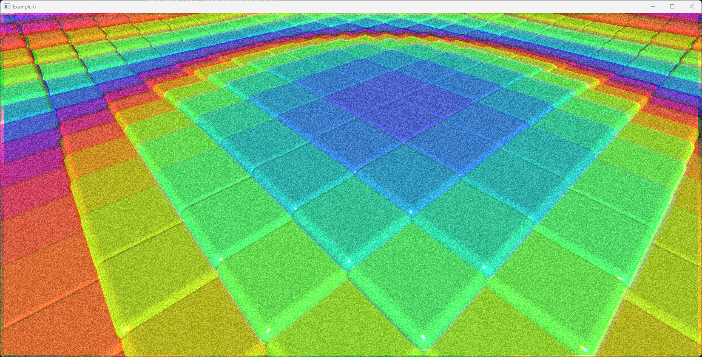

# Coding at the speed of light


As I have mentioned in my previous post, I have been working on my graphics library Ivf++ 2.0. There are many features I would like to implement, but as this is a hobby project I have limited time to work on it. My common approach has been to select a feature to implement, do research online, and then start coding. You start with great energy and enthusiasm, but you often get stuck on small things as you progress. Why doesn't this approach work? How does this function work? Why is this not rendering correctly? These are some of the questions that come up. You can spend hours figuring out the problem; sometimes, you can't find the solution. This can be very frustrating and demotivating.

Some time ago, I started exploring AI tools. In 2022, I started experimenting with ChatGPT, first by letting it suggest improvements to existing codes in Python. I was amazed at the improvements it suggested. I also used it to answer questions on different programming topics. One thing that impressed me was the ability of the language model to translate numerical code written in Python and Numpy to C++ and Eigen. Worked almost perfectly. Later, during 2023, I used it in the refactoring of ObjectiveFrame. It helped me to refactor the codebase and make it more readable.

Another AI tool that I started using as an early adopter was Github Copilot from Microsoft. It is a code completion that uses a language model to provide the completions. For me, it has made it fun to code again. It's almost like having a pair of programmers who know everything and help out with the boring parts of coding. By combining classical chat-based AI with Copilot, I have implemented features in Ivf++ 2.0 at a pace that I would not have been able to do otherwise. It feels like coding at the speed of light. In the rest of this post, I will describe some examples of how I have used these tools in the development of Ivf++ 2.0.

<!-- more -->

## Implementing selection rendering

One of the features I wanted to implement was selection rendering. This feature allows you to select objects in the scene by clicking on them. I used buffer selection in my previous implementation of Ivf++ in OpenGL 1.1. This is a deprecated feature in OpenGL, and I wanted to implement something that would work in modern OpenGL. I have read earlier that this could be accomplished using shaders. The approach is to render all objects in the scene with a unique color and then read the pixel color under the mouse cursor. This color can then be used to identify the object that was clicked on. When it comes to shaders, I am still a beginner, so I decided to ask Claude for help. 

First, I asked a high-level question on different approaches to implementing selection rendering in modern OpenGL.

!!! question 

    I have implemented a scene graph library i C++/OpenGL supporting hierarchical object structures. I would like to be able to interact with the rendered objects. What is the best approach to implement object selection?
    
The answer I got gave an overview of the different methods of implementing selection rendering in modern OpenGL. The answer I got in short form was:

!!! answer

    For implementing object selection in a scene graph with OpenGL, there are several common approaches, each with their own trade-offs. Let me explain the main techniques:

    Ray Casting with Bounding Volumes:

    [ description of the method and code examples ]

    Color Picking:

    [ description of the method and code examples ]

    GPU picking using Compute shaders

    [ description of the method and code examples ]


Every approach was provided with a code example. I decided to go with the color picking approach. Then I asked the follow up question:

!!! question

    Ok, the buffer selection seems to be the quickest way forward. Please suggest suitable shaders and implementation for buffer selection.

It then answered:

!!! answer

    I'll help you implement color buffer selection, which is indeed a straightforward approach. Here's a complete implementation:

    [ Implementing a color buffer in C++/OpenGL ] 

    Vertex shader:

    [ GLSL verted shader ]

    Fragment shader:

    [ GLSL fragment shader ]

    Integration of the shaders in the rendering pipeline:

    [ C++ code implementing in scene graph ]

The suggested shaders were a bit different from the shaders I hade implemented in Ivf++, so I asked Claude to help me modify them to fit my implementation. 

!!! question

    I want to use the same structure as my standard shader, would this work as a fragment shader?

        #version 330 core
        in vec3 normal;  
        in vec3 fragPos;  
        in vec4 color;
        in vec2 texCoord;
        uniform uint objectId;
        out vec4 fragColor;
        void main()
        {
            fragColor = vec4(float(objectId & 0xFF) / 255.0, float((objectId >> 8) & 0xFF) / 255.0, float((objectId >> 16) & 0xFF) / 255.0, 1.0);
        }

The answer was almost like having a conversation with an OpenGL expert. It also gave me the code for decoding the value when reading back from the selection buffer. I have to buy Claude a beer next time I meet him.

!!! answer

    Yes, your approach using `vec4` as output and encoding the objectId into RGB components is a valid alternative to my suggestion! This is actually a more traditional approach and has some advantages:

    1. It's compatible with standard framebuffer formats (no need for R32UI)
    2. Works with older OpenGL versions
    3. Reuses your existing vertex shader and interpolated attributes

    The key differences:
    - Your shader packs the ID into RGB channels (24-bit ID space = 16,777,216 unique IDs)
    - My version used R32UI (32-bit ID space = 4,294,967,296 unique IDs)

    When reading the selection buffer, you'll need to decode the ID:

    ```cpp
    uint32_t readPixel(int x, int y) {
        unsigned char pixel[3];
        glReadPixels(x, y, 1, 1, GL_RGB, GL_UNSIGNED_BYTE, pixel);
        return pixel[0] | (pixel[1] << 8) | (pixel[2] << 16);
    }
    ```

    This approach will work perfectly fine for most scene graphs. The only limitation would be if you need more than 16.7 million unique objects, which is rarely the case.

    Would you like me to show how to integrate this with the rest of the selection buffer code?

Now, I have what I need to start implementing the selection process in Ivf++. However, during this process, I needed a way to debug how the library was rendering the objects with unique identifiers, so I asked Claude for help with this as well.

!!! question

    What would be a good way of debugging this?

The answer was to use a debug shader that would render the object with the unique color. It also provided me with the code for the debug shader. Really helpful.

```cpp
#version 330 core
in vec3 normal;  
in vec3 fragPos;  
in vec4 color;
in vec2 texCoord;
uniform uint objectId;
uniform bool debugMode;
out vec4 fragColor;

void main()
{
    vec4 idColor = vec4(
        float(objectId & 0xFF) / 255.0, 
        float((objectId >> 8) & 0xFF) / 255.0, 
        float((objectId >> 16) & 0xFF) / 255.0, 
        1.0
    );
    
    // In debug mode, make colors more visible
    if (debugMode) {
        fragColor = idColor * 0.8 + vec4(0.2);  // Brighten for visibility
    } else {
        fragColor = idColor;
    }
}
```

## Implementing a Spline interpolation class

Another feature I wanted to implement was a spline interpolation class. I had implemented this before in Ivf++ 1.0, but I wanted to improve the implementation. After getting some experience in writing prompts, I know now that it is essential to be very specific and provide as many details as possible when asking the AI for help. So, to get the code I want, I give it clear instructions, such as dividing up the class in a header and a source file, what prefix to use for the class attributes, and how I want the methods to work. The final prompt became:

!!! question

    
    I would like to have a Spline class in C++ where you can add points. All the points should be included in the spline. t = 0.0 -> first point. t = n - 1 is the last point. Positions on the spline should be retrieved by either specifying the t or the actual geometric distance from the first point. Use glm for the points. member attributes should use m_ as prefix. Separate include and source files. Use pragma once for header guard.

The anwser was almot perfect. I only had to make some minor adjustments in the final code. 

```cpp
// Spline.h
#pragma once
#include <vector>
#include <glm/glm.hpp>

class Spline {
public:
    // Add a point to the spline
    void addPoint(const glm::vec3& point);
    
    // Get position on spline using parameter t
    // t ranges from 0 to (number of points - 1)
    glm::vec3 getPositionByT(float t) const;
    
    // Get position on spline using distance from start
    glm::vec3 getPositionByDistance(float distance) const;
    
    // Get total length of the spline
    float getTotalLength() const;
    
    // Get number of points in the spline
    size_t getPointCount() const;
    
    // Clear all points
    void clear();

private:
    std::vector<glm::vec3> m_points;
    std::vector<float> m_distances; // Cumulative distances from start
    
    // Recalculate cumulative distances when points change
    void updateDistances();
    
    // Convert distance to t parameter
    float distanceToT(float distance) const;
    
    // Cubic interpolation between points
    glm::vec3 interpolate(const glm::vec3& p0, const glm::vec3& p1, 
                         const glm::vec3& p2, const glm::vec3& p3, 
                         float t) const;
};

// Spline.cpp
#include "Spline.h"
#include <algorithm>

void Spline::addPoint(const glm::vec3& point) {
    m_points.push_back(point);
    updateDistances();
}

void Spline::updateDistances() {
    m_distances.clear();
    m_distances.push_back(0.0f);
    
    for (size_t i = 1; i < m_points.size(); ++i) {
        float segmentLength = glm::length(m_points[i] - m_points[i-1]);
        m_distances.push_back(m_distances.back() + segmentLength);
    }
}

float Spline::distanceToT(float distance) const {
    if (m_points.size() < 2) return 0.0f;
    
    // Find the segment containing this distance
    auto it = std::lower_bound(m_distances.begin(), m_distances.end(), distance);
    if (it == m_distances.begin()) return 0.0f;
    if (it == m_distances.end()) return static_cast<float>(m_points.size() - 1);
    
    // Get segment index and interpolation factor
    size_t index = std::distance(m_distances.begin(), it) - 1;
    float segmentStart = m_distances[index];
    float segmentLength = m_distances[index + 1] - segmentStart;
    float segmentT = (distance - segmentStart) / segmentLength;
    
    return static_cast<float>(index) + segmentT;
}

glm::vec3 Spline::getPositionByDistance(float distance) const {
    return getPositionByT(distanceToT(distance));
}

glm::vec3 Spline::getPositionByT(float t) const {
    if (m_points.size() < 2) {
        return m_points.empty() ? glm::vec3(0.0f) : m_points[0];
    }
    
    // Clamp t to valid range
    t = std::max(0.0f, std::min(t, static_cast<float>(m_points.size() - 1)));
    
    // Find the segment containing t
    size_t segment = static_cast<size_t>(t);
    if (segment >= m_points.size() - 1) {
        return m_points.back();
    }
    
    // Get surrounding points for interpolation
    glm::vec3 p0 = segment > 0 ? m_points[segment - 1] : m_points[0];
    glm::vec3 p1 = m_points[segment];
    glm::vec3 p2 = m_points[segment + 1];
    glm::vec3 p3 = segment < m_points.size() - 2 ? m_points[segment + 2] : p2;
    
    float localT = t - static_cast<float>(segment);
    return interpolate(p0, p1, p2, p3, localT);
}

glm::vec3 Spline::interpolate(const glm::vec3& p0, const glm::vec3& p1,
                             const glm::vec3& p2, const glm::vec3& p3,
                             float t) const {
    // Catmull-Rom spline interpolation
    float t2 = t * t;
    float t3 = t2 * t;
    
    glm::vec3 a = p1;
    glm::vec3 b = 0.5f * (p2 - p0);
    glm::vec3 c = 0.5f * (2.0f * p0 - 5.0f * p1 + 4.0f * p2 - p3);
    glm::vec3 d = 0.5f * (-p0 + 3.0f * p1 - 3.0f * p2 + p3);
    
    return a + b * t + c * t2 + d * t3;
}

float Spline::getTotalLength() const {
    return m_distances.empty() ? 0.0f : m_distances.back();
}

size_t Spline::getPointCount() const {
    return m_points.size();
}

void Spline::clear() {
    m_points.clear();
    m_distances.clear();
}
```

## Implementing post processing effects

As a creative coder, you always want to be able to add cool effects to your rendering. I wanted to add a post-processing pipeline to the rendering. I had some ideas on how to implement this, but I wanted to get some input from Claude on how to best implement this. As input, I also gave Claude the current rendering method in Ivf++ that I wanted to extend with post-processing effects.

!!! question

    I have the following rendering method:

    ```cpp
    void GLFWSceneWindow::doDraw()
    {
        GLFWWindow::doDraw();
        glClearColor(0.07f, 0.13f, 0.17f, 1.0f);
        glClear(GL_COLOR_BUFFER_BIT | GL_DEPTH_BUFFER_BIT);
        m_scene->draw();
    }
    ```
    that renders directly to a window. I would like to add post fx shaders after rendering. Suggest how this can be implemented.

I got a very detailed answer with the basic approach and code examples. 

!!! answer

    To implement post-processing effects, you'll need to:

    1. Render your scene to a framebuffer object (FBO) instead of directly to the screen
    2. Create a full-screen quad to render the final result
    3. Apply post-processing shaders using the scene texture as input

    [ Example code ]

Claude also provided hints and code on implementing a ping-pong buffer for the post-processing effects. This would have been a real pain to implement by reading documentation and tutorials. 

I also asked it to provide me with implementations for some common post-processing effects, such as blur, bloom, and tone mapping. Below is the code for the blur effect that it provided.

```glsl
#version 330 core
out vec4 FragColor;
in vec2 TexCoords;
uniform sampler2D screenTexture;
uniform float blurSize = 0.003; // Adjust for blur strength

void main()
{
    vec2 texelSize = blurSize / textureSize(screenTexture, 0);
    vec3 result = vec3(0.0);
    
    // 3x3 kernel
    for(int x = -1; x <= 1; x++) {
        for(int y = -1; y <= 1; y++) {
            vec2 offset = vec2(float(x), float(y)) * texelSize;
            result += texture(screenTexture, TexCoords + offset).rgb;
        }
    }
    
    result = result / 9.0;
    FragColor = vec4(result, 1.0);
}
```

The following screenshot shows an example application with some post effects applied.



## Conclusion

By using AI tools like ChatGPT and Github Copilot, I have been able to implement features in Ivf++ 2.0 at a pace that I would not have been able to otherwise. Instead of getting stuck on implementation details, you can work on the same level as an architect or a designer. Provide a high-level design description and then let the AI assistant implement the finer details. This has given me the ability to focus on the design of the API and the overall architecture.

!!! quote

    Coding at the speed of light is not about typing faster. It's about leveraging AI tools to focus on the high-level design and architecture of your software, while the AI takes care of the implementation details. This allows you to work at a pace that would not have been possible otherwise.

AI tools will revolutionize software development by enhancing developer creativity and productivity. However, their effective use still requires deep domain knowledge and technical expertise. Rather than replacing fundamental skills, AI serves as a powerful accelerator for experienced developers who understand both the problem space and the capabilities of their tools. The future of software development lies in this synergy between human expertise and AI assistance.

