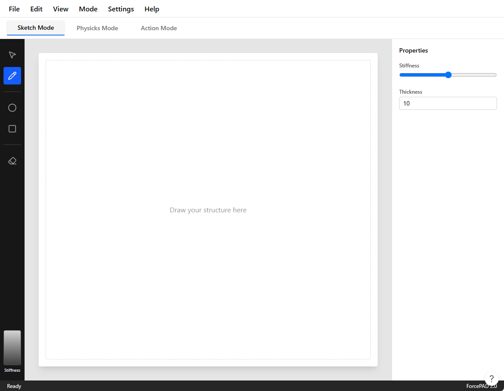

# ForcePAD from Legacy to Modern


The ForcePAD application started life in the early 2000s as a research tool built with C++ and FLTK, with graphics rendered through OpenGL. At the time, that was a practical choice. It was portable enough to run on both Windows and Unix/Linux systems, and it could take advantage of hardware-accelerated graphics on the workstations available to us. For a long time, it served that purpose very well.

Over the years, however, the software started to show its age. FLTK felt increasingly dated, and the fixed-function OpenGL pipeline that once made the application feel modern became a liability. The result was not only a maintenance problem; it also became harder to build and run on newer systems, especially outside the desktop environment where the application had originally been developed.

What makes this story interesting is that the change did not begin as a grand rewrite. I did not want to throw away the model that had already proven itself in research and teaching. The core idea of the application was still sound: users sketch structures, add constraints and loads, and then inspect the resulting behavior. The goal was therefore not to redesign the application from scratch, but to move it forward while preserving what had already worked.

That is why the migration became a careful transition from old to new. I kept the underlying mechanics and the conceptual model intact while gradually replacing the layers that had become obstacles: the user interface, the rendering path, and the surrounding infrastructure. In that sense, this was less a rewrite than a modernization project built around continuity.

<!-- more -->

Initially I considered rewriting the application from scratch using a modern C++ framework such as Qt. That idea was appealing, but it would have required a lot of work and a complete reimplementation of the user interface and graphics stack. The current application model was still valid, and I wanted to keep it. The better option was to see what it would take to modernize the application and make it portable to modern platforms without losing the behavior that had already been validated in practice.

The work therefore fell into three main areas:

1. Replace FLTK with a modern C++ GUI framework that supports OpenGL and is portable to modern platforms.
2. Modernize the existing application code to use contemporary C++ conventions and safer abstractions.
3. Replace the legacy OpenGL fixed-function pipeline with a shader-based rendering approach that could eventually support WebAssembly and other modern targets.

These are significant tasks, and a couple of years ago I would probably have hesitated to take them on. But experience with AI-assisted coding made the process feel much more realistic. I had already seen how it could accelerate implementation, help with code generation, and reduce the friction of working in large, older codebases. That made it possible to approach the migration not as a risky leap but as a series of manageable steps.

## A migration strategy

The key decision was to preserve the existing application model and replace the surrounding technology incrementally. The old ForcePAD implementation already contained a lot of valuable logic: finite element routines, model handling, interaction rules, and the overall workflow. What had become outdated was mainly the platform around it.

That is why I treated the transition as a series of layered changes rather than a single big-bang rewrite. The user interface could be modernized first, the rendering path could be replaced later, and the old and new implementations could coexist while the migration was underway. This reduced the risk dramatically and made it much easier to test and validate each step.

## A new user interface

Qt offers far more flexibility for building a modern interface, so I decided to do a major user interface overhaul. Instead of jumping straight into the Qt implementation, I first created a mockup of the new user interface in Figma. That allowed me to iterate quickly and evaluate what would work before committing to the real implementation. One interesting feature of Figma is its built-in AI-assisted design tools, which can generate design elements from text prompts. To create the mockup, I started with the following prompt:

!!! question 

    I am working on a refactoring of the ForcePAD application (see attached image). The application is a 2D mechanics application where you paint with stiffness. It has 3 main mode. Sketch mode - Drawing structures with stiffness, Physicks mode - Adding constraints and boundary conditions, Action mode - visualising deflections and stresses in the structure.

    Main idea. 3 tabs for the main modes with related tools in each tab. The attached images shows the different modes. I am using Qt for the refactoring and I want to use the standard Windows 11 style.

After a couple of iterations Figma generated a fully functional mockup of the new user interface. The following image shows the final mockup of the new user interface.



This mockup was, of course, not directly usable in Qt. But it was still valuable because it gave me a clear design direction. I therefore used Figma to generate a textual description that could be used to drive the Qt implementation. That is exactly what I did. I used the following prompt to generate a textual description of the user interface:

!!! question

    Looks good. I need a plain text description which I can give to Claude Code to contine refactoring my Qt interface.

This is the generated textual description of the user interface:

```markdown
ForcePAD Application - UI Specification

Overview

ForcePAD is a 2D structural mechanics application where users "paint with stiffness"
to design and analyze beam structures. The application has three primary modes accessed 
via tabs, each with dedicated toolsets.

Application Layout

Top-Level Structure

┌─────────────────────────────────────────────┐
│ Menu Bar                                    │
├─────────────────────────────────────────────┤
│ Mode Tabs: [Sketch] [Physicks] [Action]     │
├──┬──────────────────────────────────────┬───┤
│  │                                      │   │
│T │      Canvas Area (white)             │ P │
│o │                                      │ r │
│o │                                      │ o │
│l │                                      │ p │
│b │                                      │ s │
│a │                                      │   │
│r │                                      │   │
│  │                                      │   │
├──┴──────────────────────────────────────┴───┤
│ Status Bar                                  │
└─────────────────────────────────────────────┘

Main Components
Menu Bar (top, ~40px height)

Standard menus: File, Edit, View, Mode, Settings, Help
White background, subtle bottom border
Windows 11 native styling

Mode Tab Bar (below menu, ~48px height)

Three tabs: "Sketch Mode", "Physicks Mode", "Action Mode"
Active tab highlighted with accent color (blue underline)
Light gray background, tabs have rounded top corners
Left Toolbar (vertical, ~56px width)

... More descriptions follow ...
```

I used Claude Code to generate the Qt code for the user interface based on this textual description. Surprisingly, it produced a fully working Qt application with the new user interface wired up directly in C++ code.

## Careful transition from FLTK to Qt


The existing FLTK version of ForcePAD is a large application with many features. For that reason, I decided to make the transition carefully. I started by creating an additional target, ```qtforcepad```, in the build system. This allowed me to build both the existing FLTK version and the new Qt version of ForcePAD in parallel. In the first step, I focused on the transition to Qt and postponed the porting of the legacy OpenGL code. My rule was to take one step at a time.

Functionality in the legacy ForcePAD is implemented in several libraries:

* calfem - The core library for finite element analysis.
* ivf2d - The library for 2D graphics and user interaction (Fixed function OpenGL).
* common - The library for common functionality such as file I/O, data structures, etc.

The main interaction in the ForcePAD application is implemented in the ``PaintView`` class. This class handles all the interaction with the underlying graphics library and the user interface. In an earlier porting attempt, I had already abstracted the class into a base class so that a Qt version could be created later. The legacy version of ForcePAD uses the ``FlPaintView`` class to implement FLTK functionality. Before starting the port, I decided to create a new library, ``paintview``, containing the base class ``PaintView``. This library is shared between the FLTK port and the Qt port.

The ``QtPaintView`` class derives from the ``QOpenGLWidget`` and ``PaintView`` base classes and implements the functionality of the ``PaintView``-class. 

This approach let me reuse a lot of the existing functionality in the legacy ForcePAD application. The following code shows some of the definitions in ``fp::PaintView``:

```cpp
class PaintView {
public:
    /*
     *    Edit modes
     */
    enum TEditMode {
        EM_BRUSH,
        EM_DIRECT_BRUSH,
        EM_ERASE,
        /*
         *  ... more modes ...
         */
        EM_PASTE,
        EM_RESULT,
        EM_RULER,
        EM_ARCH
    };

    enum TImportMode {
        IM_NEW_MODEL,
        IM_PASTE
    };

    enum TViewMode {
        VM_SKETCH,
        VM_PHYSICS,
        VM_ACTION
    };

    enum TVisualisationMode {
        VM_PRINCIPAL_STRESS,
        VM_MISES_STRESS,
        VM_DISPLACEMENTS,
        VM_STRUCTURE
    };

    // ... more code ...

protected:

    // ... more code ...

    TEditMode m_editMode;
    TViewMode m_viewMode;
    TVisualisationMode m_visualisationMode;    
```

Basically ``fp::PaintView`` is a state machine that handles the different modes of the application. The ``QtPaintView`` class implements the functionality of the ``PaintView`` class and handles the interaction with the user interface and the underlying graphics library.

The class also contains a number of virtual functions that are supposed to be implemented in the derived classes. The following code shows some of the virtual functions in ``fp::PaintView``:

```cpp
    virtual void doRedraw();
    virtual void doFlush();
    virtual void doInvalidate();
    virtual void doMakeCurrent();

    // ... more code ...

    virtual const std::string doSaveDialog(const std::string title, const std::string filter,
                                       const std::string defaultFilename);
```

These virtual functions are called by the derived classes to implement the functionality of the ``PaintView`` class. The ``QtPaintView`` class implements these functions using the Qt framework.

Using Claude Code, I was able to implement the ``QtPaintView`` class in a few hours. The following code shows the implementation of the ``doSaveDialog()`` function:

```cpp
const std::string QtPaintView::doSaveDialog(const std::string title, const std::string filter,
                                             const std::string defaultFilename)
{
    QString qfilter = QString::fromStdString(filter);
    if (qfilter.isEmpty())
        qfilter = "ForcePAD Files (*.fp2);;All Files (*)";

    QString fname = QFileDialog::getSaveFileName(
        this,
        QString::fromStdString(title),
        QString::fromStdString(defaultFilename),
        qfilter
    );
    return fname.toStdString();
}
```

Claude Code also wired up the signals and slots in the ``QtPaintView`` class to handle user interaction in the ``MainWindow``-class. 

```cpp
MainWindow::MainWindow(QWidget *parent)
    : QMainWindow(parent)
{
    m_paintView = new QtPaintView(this);

    m_paintView->setModeChangeEvent(this);
    m_paintView->setViewModeChangeEvent(this);
    m_paintView->setViewModeErrorEvent(this);
    m_paintView->setModelLoadedEvent(this);
    m_paintView->setNewModelEvent(this);

    // ...

    m_paintView->setViewMode(fp::PaintView::VM_SKETCH);

    setWindowTitle("ForcePAD");
    resize(1280, 800);
}
```

Since most of the functionality is implemented in the ``PaintView`` class, I was able to implement the ``QtPaintView`` class fairly quickly. Many of the event slots could be implemented by simply delegating the call to the ``PaintView`` class. The following code shows a few examples of slots calling the ``PaintView`` class:

```cpp
void MainWindow::fileNew()    { m_paintView->newModel(); }
void MainWindow::fileOpen()   { m_paintView->openModel(); }
void MainWindow::fileSave()   { m_paintView->saveModel(); }
void MainWindow::fileSaveAs() { m_paintView->saveModelAs(); }
void MainWindow::editUndo()  { m_paintView->undo(); }
```

## Legacy OpenGL to Modern OpenGL


Once the user interface had been implemented in Qt, I turned my attention to the graphics code. The legacy ForcePAD application uses the old fixed-function OpenGL pipeline, which is no longer supported on many platforms. Since ForcePAD is used in teaching, this was a major limitation: the application could not easily be compiled for modern platforms, including the web. That made it clear that I needed to replace the legacy OpenGL code with a modern approach.

That was not as simple as it sounded. The legacy OpenGL code is implemented in the ``ivf2d`` library, which contains a great deal of functionality for 2D graphics and user interaction. The library is also quite large and complex, so replacing the legacy OpenGL code with a modern implementation would be a significant undertaking. The question was whether that could be done without rewriting the entire library.

I asked Claude Code whether it would be possible to replace the legacy OpenGL code with a modern implementation without rewriting the entire library. Before committing to an approach, I let it develop a plan for modernizing the OpenGL code so I could evaluate whether the idea was feasible and whether it could be implemented within a reasonable time frame. The following is the plan that Claude Code developed.

To summarize the plan, Claude set the following goal:

**Goal:** Replace all legacy/fixed-function OpenGL in the ForcePAD rendering path with a small modern-GL abstraction (VBO + shaders, GLES-compatible), so that the *desktop* `qtforcepad` build keeps working while the code becomes portable to **WebGL 2 (OpenGL ES 3.0)** for the future Qt-for-WebAssembly port.

After defining these overarching goals, Claude Code developed a detailed plan for modernizing the OpenGL code. The plan is divided into several steps:

1. Rendering inventory: Identify all legacy OpenGL calls in the `ivf2d` library and categorize them by functionality (e.g., drawing primitives, transformations, text rendering, etc.).
2. Abstraction layer: Create a small abstraction layer that encapsulates modern OpenGL functionality (VBOs, VAOs, shaders) and provides a similar interface to the legacy OpenGL calls. This layer should be designed to be compatible with both desktop OpenGL and WebGL 2.
3. Create the scaffolding such as a small matrix library `Mat4`, shader support `GLProgram`, the rendering layer class `Renderer2D`, and the texture abstraction for the image lahyer in ForcePAD `StreamTexture`.
4. Phased implementation of the rendering functionality: Gradually replace legacy OpenGL calls in the `ivf2d` library with calls to the new abstraction layer. Start with simple primitives and gradually move to more complex rendering tasks.
5. Finally integrating the new rendering layer into the `PaintView` class and ensure that the application continues to function correctly.
6. Testing and validation: Thoroughly test the application to ensure that the new rendering layer works correctly and that there are no regressions in functionality or performance. Finally changing from a compatibility mode to a modern OpenGL mode in ForcePAD.

The final plan was much longer and required several iterations before it reached its final form. It was very detailed and required a lot of work to implement. However, I was confident that it was feasible and that it could be carried out within a reasonable time frame.

### Renderer2D - The new rendering layer

Perhaps the most interesting part of the plan is the ``Renderer2D`` class. This class is the main interface between the ForcePAD application and the underlying graphics library. The class is responsible for rendering all the graphics in the application. The idea is to provide enough functionality in the ``Renderer2D`` class to be able to implement all the functionality in the ForcePAD application without having to use any legacy OpenGL calls. The class is implemented as a singleton pattern as it emulates the fixed function state machine The following code shows the definition of the ``Renderer2D`` class:

```cpp
class Renderer2D {
public:
    enum Primitive {
        Triangles,
        TriangleStrip,
        TriangleFan,
        Lines,
        LineStrip,
        LineLoop,
        Points,
        Quads // emulated: expanded to Triangles on flush
    };

    static Renderer2D &instance();

    /** Releases GL resources. Call with the owning context current. */
    void destroy();

    // --- projection / transform (replaces the fixed-function matrix stack) ---

    /** Sets the projection, equivalent to gluOrtho2D(l, r, b, t). */
    void setOrtho(float l, float r, float b, float t);
    void setProjection(const Mat4 &projection);

    void loadIdentity();
    void pushTransform();
    void popTransform();
    void translate(float x, float y);
    void rotateZ(float degrees);
    void scale(float sx, float sy);

    /** Resets the transform stack to a single identity (call once per frame). */
    void resetTransform();

    // --- GL state helpers so callers need no direct GL/Qt dependency ---

    void setViewport(int x, int y, int w, int h);
    void setScissor(int x, int y, int w, int h);
    void setScissorEnabled(bool enable);
    void clear(float r, float g, float b, float a);

    // --- immediate-mode-style batching ---

    void begin(Primitive primitive);
    void beginQuads() { begin(Quads); }
    void beginTriangles() { begin(Triangles); }
    void beginTriangleFan() { begin(TriangleFan); }
    void beginLines(float width = 1.0f);
    void beginLineStrip(float width = 1.0f);
    void beginLineLoop(float width = 1.0f);

    /**
     * Dashed GL_LINES batch, replacing glLineStipple. The dash distance is
     * computed automatically per segment (pixels on / off = periodPixels/2),
     * so callers just emit vertex pairs as with beginLines().
     */
    void beginDashedLines(float width, float periodPixels);

    void color(float r, float g, float b, float a = 1.0f);
    void color3fv(const float *rgb) { color(rgb[0], rgb[1], rgb[2], 1.0f); }
    void texCoord(float u, float v);
    void vertex(float x, float y);

    /** Flushes the accumulated primitive as a single draw call. */
    void end();
```

In the following example shows how the fixed function OpenGL code is replaced with the new ``Renderer2D`` class:

<div class="grid" markdown>

<div markdown>

**Legacy OpenGL**

```cpp
glBegin(GL_QUADS);
glColor3fv(c);
glVertex2i(x, y);
...
glEnd();
```

</div>

<div markdown>

**Renderer2D**

```cpp
auto &r = Renderer2D::instance();
r.beginQuads();
r.color(cr, cg, cb);
r.vertex(x, y);
...
r.end();
```

</div>

</div>

Using this approach Claude Code could automatically replace the legacy OpenGL code with the new ``Renderer2D`` class. If a OpenGL construct was found that was not in the class it was added. The following code shows an example of how the legacy OpenGL code is replaced with the new ``Renderer2D`` class:

```cpp
void Line::doGeometry()
{
	Renderer2D &r = Renderer2D::instance();
	r.beginQuads();
		r.vertex((float)m_p1.getX(), (float)m_p1.getY());
		r.vertex((float)m_p2.getX(), (float)m_p2.getY());
		r.vertex((float)m_p3.getX(), (float)m_p3.getY());
		r.vertex((float)m_p4.getX(), (float)m_p4.getY());
	r.end();
}
```

### A new shader based rendering layer

To support the ``Renderer2D`` class a new shader based rendering layer was implemented. The rendering layer is implemented in the ``ivf2d`` library. The rendering layer is responsible for managing the OpenGL context and the shaders as shown below:

```cpp
class GLProgram {
public:
    GLProgram();
    ~GLProgram();

    /** Compiles + links the given sources (no "#version" line). Returns success. */
    bool compile(const std::string &vertexSource, const std::string &fragmentSource);

    /** Makes this program current. */
    void use();

    /** Deletes GL resources. Safe to call with no live GL context (no-op). */
    void destroy();

    bool isValid() const { return m_program != 0; }
    unsigned int id() const { return m_program; }

    int uniformLocation(const char *name);
    int attribLocation(const char *name);

    void setMat4(const char *name, const Mat4 &matrix);
    void setInt(const char *name, int value);
    void setFloat(const char *name, float value);
    void setVec4(const char *name, float r, float g, float b, float a);

    /**
     * Returns the version + precision header for the current GL context:
     *   desktop -> "#version 330 core\n"
     *   GLES / WebGL 2 -> "#version 300 es\nprecision highp float;\n"
     */
    static std::string glslHeader();

private:
    static QOpenGLExtraFunctions *gl();
    unsigned int compileStage(unsigned int type, const std::string &source);

    unsigned int m_program{0};
};
```

It is a very light weight class that manages the OpenGL context and the shaders. The class is used by the ``Renderer2D`` class to manage the shaders and the OpenGL context. 

As the modern OpenGL implementations don't support the fixed function pipeline the rendering layer is implemented using shaders. The following code shows the very simple vertex and fragment shaders used in the rendering layer:

```glsl
static const char *kVertexShader = R"GLSL(
layout(location = 0) in vec2 aPos;
layout(location = 1) in vec4 aColor;
layout(location = 2) in vec2 aTex;

uniform mat4 uMVP;

out vec4 vColor;
out vec2 vTex;

void main()
{
    vColor = aColor;
    vTex = aTex;
    gl_Position = uMVP * vec4(aPos, 0.0, 1.0);
}
)GLSL";

static const char *kFragmentShader = R"GLSL(
in vec4 vColor;
in vec2 vTex;

uniform int uUseTexture;
uniform int uForceOpaque;
uniform int uDiscardWhite;
uniform int uDashed;
uniform float uDashPeriod;
uniform sampler2D uTex;

out vec4 fragColor;

void main()
{
    // For dashed lines vTex.x carries the along-segment distance in pixels.
    if (uDashed == 1 && fract(vTex.x / uDashPeriod) >= 0.5)
        discard;

    vec4 c = vColor;
    if (uUseTexture == 1)
    {
        vec4 texel = texture(uTex, vTex);
        // Colour key: drop pure white (all channels 255) so the texture stamps
        // as a cut-out. Half a quantisation step of slack covers filtering.
        if (uDiscardWhite == 1 && all(greaterThanEqual(texel.rgb, vec3(254.5 / 255.0))))
            discard;
        c = c * texel;
    }
    if (uForceOpaque == 1)
        c.a = 1.0;
    fragColor = c;
}
)GLSL";
```

## What this migration taught me

The biggest lesson from this work is that modernization is often less about replacing everything at once and more about finding the right seams. The core application model was still useful, but the old user interface and rendering stack were holding it back. By isolating those parts, it became possible to modernize without losing the ideas that had made the original application valuable.

It also helped to think in terms of compatibility rather than purity. Keeping the legacy and new versions available in parallel gave me a safety net. It meant I could verify behavior incrementally, compare results, and gradually move the application without losing momentum.

This kind of migration is probably easier when the software has a clear architectural boundary. In my case, the abstraction around the paint view and the rendering layer became the hinge points that made the transition work.

## Modern OpenGL and WebAssembly - A new possibility

An interesting side effect of this modernization is that it opened the door to new platforms. With the legacy OpenGL code replaced by a shader-based approach, it became feasible to target WebAssembly and WebGL. This means that you can run ForcePAD in a web browser, making it accessible to a wider audience without requiring installation or specific operating systems. We have seen in later years that IT-departments are often reluctant to install software on their systems. This is especially true for research and teaching environments where users may not have administrative privileges. By targeting WebAssembly, ForcePAD can now be used in a browser, making it much easier to deploy and use in educational settings. It is also possible to make it load models directly from URLs and provide students with direct links to examples.

As Qt supports WebAssembly and we have an updated renderer that is compatible with WebGL, the path to a browser-based version of ForcePAD became clear. To implement it fully I asked Claude Code to add a wasm target to the build system and to make sure that the application could be compiled to WebAssembly. This was a significant step, but it was made much easier by the groundwork laid in the modernization process.

The result of this work can be found at the ForcePAD web pages here: 

[https://jonaslindemann.github.io/forcepad/](https://jonaslindemann.github.io/forcepad/). 

At the site you can run the application directly in your browser, explore the new user interface, and see how the modernization has made it more accessible and maintainable. You can of course also download the application for Windows and macOS if you prefer to run it natively. The source code is available on GitHub, and the project is open for contributions and further improvements.
